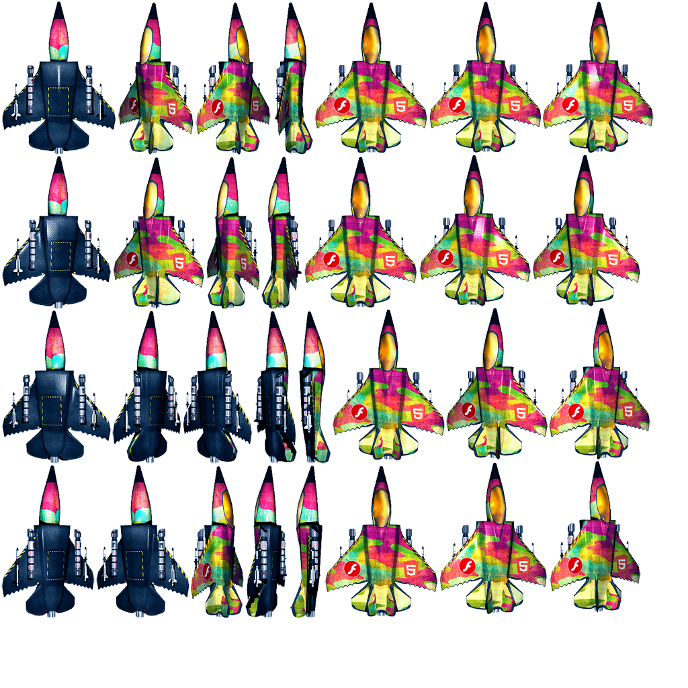
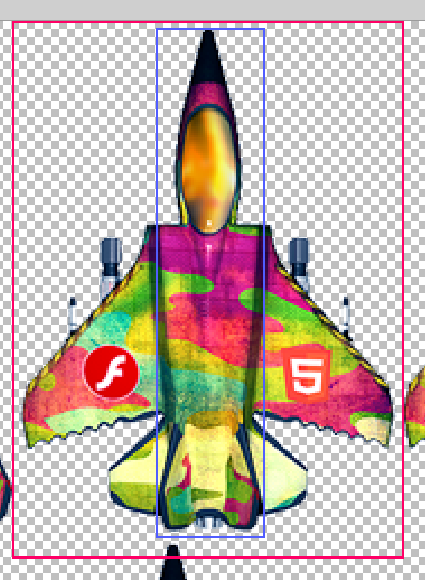

# Spritesheet Internals
```
/**
* A map containing all textures of the sprite sheet.
* Can be used to create a Sprite:
* ```js
* new PIXI.Sprite(sheet.textures["image.png"]);
* ```
*/
public textures: Dict<Texture>;

/**
* A map containing the textures for each animation.
* Can be used to create an AnimatedSprite:
* ```js
* new PIXI.AnimatedSprite(sheet.animations["anim_name"])
* ```
*/
public animations: Dict<Texture[]>;

/**
* Reference to the original JSON data.
* @type {object}
*/
public data: ISpritesheetData;
```

## JSON Data
```
/** Represents the JSON data for a spritesheet atlas. */
export interface ISpritesheetFrameData {
	frame: {
		x: number;
		y: number;
		w: number;
		h: number;
	};
	trimmed?: boolean;
	rotated?: boolean;
	sourceSize?: {
		w: number;
		h: number;
	};
	spriteSourceSize?: {
		x: number;
		y: number;
	};
	anchor?: IPointData;
}

/** Atlas format. */
export interface ISpritesheetData {
	frames: Dict<ISpritesheetFrameData>;
	animations?: Dict<string[]>;
	meta: {
		scale: string;
		// eslint-disable-next-line camelcase
		related_multi_packs?: string[];
	};
}
```

`frame` -- the dimensions of the frame *on* the spritesheet
- `x`: The x position of the frame in the spritesheet
- `y`: The y position of the frame in the spritesheet
- `w`: The width of the frame in the spritesheet
- `h`: The height of the frame in the spritesheet

`sourceSize` -- the "de facto frame size"
- `w`: The width of the largest frame in the spritesheet
- `h`: The height of the largest frame in the spritesheet

`spriteSourceSize` -- the dimensions of *this* frame, relative to the de facto frame size
- `x`: The x offset of *this* frame
- `y`: The y offset of *this* frame
- `w`: The width of *this* frame
- `h`: The height of *this* frame

The general idea is that the `frame` is the actual data from the image itself.  The `sourceSize` should be the "size" of the resulting frame stack, likely the size of the largest frame in the animation sheet (cf. the rolling plane demo).  The `spriteSourceSize` appears to be the offsets needed (based on both the `frame` and the `sourceSize`) to center this frame into the de facto frame size -- this appears to only be relevant when there are varying frame sizes within an animation (cf. plane demo vis-a-vis the number sprite demo).

#### Plane Comparison

Below is the original spritesheet for the plane.



This image below compares a frame in **red**, with the **blue** frame from the image.  It is pixel-aligned thus illustrating what `spriteSourzeSize` does in its processing.



Above, the **blue** box shows the plane frame during a barrel-roll, and thus is smaller, but also centered:

	frame: {x: 444, y: 462, w: 49, h: 228}
	rotated: false
	sourceSize: {w: 175, h: 240}
	spriteSourceSize: {x: 64, y: 3, w: 49, h: 228}
	trimmed: true

The **red** box shows a the plane frame at its widest position (the de facto frame size):

	frame: {x: 468, y: 2, w: 169, h: 226}
	rotated: false
	sourceSize: {w: 175, h: 240}
	spriteSourceSize: {x: 3, y: 4, w: 169, h: 226}
	trimmed: true


#### Number Comparison


In this example below, all frame sizes are identical (unlike the plane demo above).  As such, notice the reduction in complexity with `sourceSize` and `spriteSourceSize`, as they have trivial offsets.

**Frame 0:**

	duration: 500
	frame: {x: 0, y: 0, w: 64, h: 64}
	rotated: false
	sourceSize: {w: 64, h: 64}
	spriteSourceSize: {x: 0, y: 0, w: 64, h: 64}
	trimmed: false

**Frame 7:**

	duration: 240
	frame: {x: 448, y: 0, w: 64, h: 64}
	rotated: false
	sourceSize: {w: 64, h: 64}
	spriteSourceSize: {x: 0, y: 0, w: 64, h: 64}
	trimmed: false